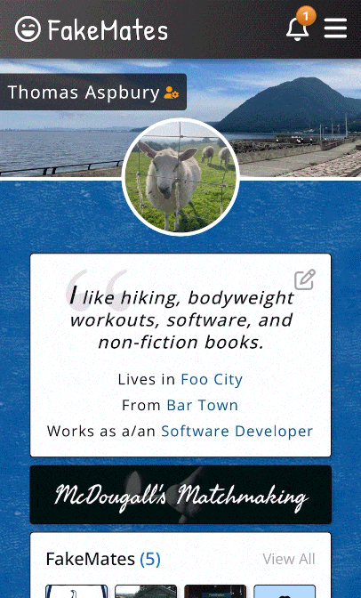
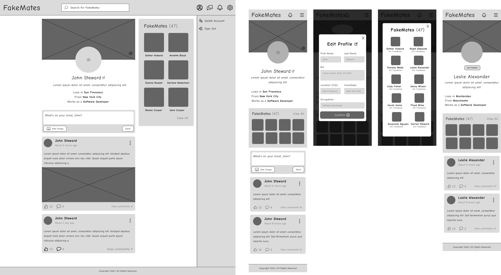
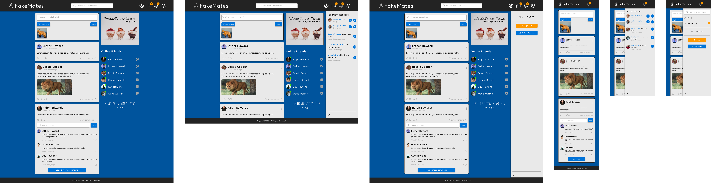

# 📱🌐 FakeMates™ - A Social Media Sensation\* 🌟

\* **Note**: not a verified - nor a credible - claim.

  

## Table Of Contents

  
Expand Contents

- [About this project](#about-this-project)
  - [What it does](#what-it-does)
  - [How to use it](#how-to-use-it)
  - [Thought process](#thought-process)
  - [How I approached it](#how-i-approached-it)
  - [Features](#features)
  - [Code samples](#code-samples)
  - [Designs](#designs)
  - [Architecture](#architecture)
  - [Tools I used](#tools-i-used)
  - [Technical decisions](#technical-decisions)
- [Thoughts and considerations](#thoughts-considerations)
  - [What I learned](#what-i-learned)
  - [Returning to an older project](#returning-to-older-project)
  - [Changes I would make in this project](#changes-i-would-make)
  - [Changes I made in the next project](#how-i-learned-from-mistakes)
  - [Challenges I faced](#challenges-i-faced)
  - [Strengths of the project](#strengths-of-project)
  - [Areas to improve](#areas-to-improve)
- [Final thoughts](#final-thoughts)

## ℹ️ About this project 

With this project I wanted to put into practice all I had learned during the [Odin Project](https://www.theodinproject.com/) curriculum. I aimed to create a more maintanable codebase with better separation of concerns, and to mix tools across the stack including React, Express, and MongoDB.

### ❓ What it does 

Users can send FakeMate™ requests, post humourous updates with emojis and images, write snarky comments, receive notifications whenever friends are active, and personalize their profile. On the roadmap is also a messenger feature where users can chat privately or in groups.

### 📖 How to use it 

**Note**: currently there is no production version. I sincerely apologize.

1. Register with Google account or email and password
2. Create new posts on the timeline, comment and like your friend's posts
3. Personalize your profile page and visit your friend's profiles
4. Send friend requests to anybody who, you hope, will accept

### 🧠 Thought process 

- No tutorials/run throughs, straight up perseverance and Google-fu.
- Methodical approach, no jumping into IDE with only a vague idea of what I wanted to build.
- Harden code with tests and handle edge cases with conditionals, not a "this code works" attitude but a "this code works, _securely_" one.

### 🛣️ How I approached it 

1. Created basic user stories like "As a user I want to be able to update my avatar so that everybody can see how gorgeous I am"
2. Worked out which pages I would need (sitemap), accounting for all functionality defined in user stories
3. Created wireframes and then full mock-ups for each page in Figma
4. Modelled data by looking for nouns in mock-ups, for example `Message`s and `Conversation`s
5. Worked out which REST endpoints I would need, and which HTTP verbs to use for each
6. Implemented backend first, then client

### 🛠️ Features 

- Social login with Google
- Timeline with infinite scroll
- Posts and comments, "like" functionality for both
- Friend request system
- Customizable private/public profiles
- Notification system (currently updates on refresh - Websocket implementation on roadmap)
- User search (backend implementation only)
- Messenger (backend implementation only)

### 📋 Code samples 

- [Custom CSS with BEM](/client/src/pages/Profile/FriendsListModal/FriendsListModal.css)
- [CSS reset and tokens](/client/src/App.css)
- [Comprehensive API tests](/server/tests/integration/comment.test.js)
- [Custom middleware](/server/src/middlewares/validate.js)
- [Sanitization/validation with Joi](/server/src/validations/post.validation.js)
- [Mongoose model with hooks](/server/src/models/conversation.model.js)
- [Business logic checking for edge cases](/server/src/controllers/friend-request.controller.js)
- [Separating routing and business logic](/server/src/routes/post.route.js)
- [Use of clear comments](/server/src/controllers/comment.controller.js)
- [Custom React hook](/client/src/hooks/useFetch.jsx)
- [Custom carousel implementation](/client/src/components/AdsCarousel/AdsCarousel.jsx)
- [Custom webpack config](/client/webpack.config.js)

### 🎨 Designs 

I designed my app using Figma and enjoyed learning about design fundamentals (typography, colour theory, etc). I learned about the work of a designer which is the biggest lesson when considering a collaborative workplace. These designs helped me focus on implementation during development as I was able to reference them throughout. The following are samples of wireframes (profile page) and full mockups (timeline):

  

  

### 🏛️ Architecture (dev only) 

- Client: React, Webpack dev server, proxied API requests to server
- Server: Nodemon, Express, Mongoose
- Database: MongoDB daemon running locally, visualized in MongoDB Compass GUI
- Network: Switched between localhost and private IP to test usability on multiple devices on network

### 🔨 Tools I used 

- React ecosystem (React Router, Formik, Yup, date-fns)
- Webpack bundler
- Express, Mongoose, Joi, Multer
- Passport.js, JWT tokens
- Supertest, Jest, and mongodb-memory-server
- Figma

### 🔧 Technical decisions 

- All resources in REST API have no nested path segments beyond the pattern resource/id, and are made specific via parameters such as `/conversations?type=group`. This is more extensible, for example if I wanted a widget showing latest `Comment` on landing page, outside context of its related `Post`.
- JWT access token stored in an HTTP only cookie to prevent XSS, and has a max age of 15 minutes - simpler way to send credentials to the backend.
- CSS written with BEM methodology to organize previously unwieldy CSS (and I _do_ mean unwieldy).
- Skeleton loaders instead of spinner - improved UX.
- Custom feature implementations to learn the fundamentals, for example:
  - Infinite scroll (timeline) which uses native browser IntersectionObserver API, callback refs, etc
  - Carousel with autoplay (ads)
  - Sliding drawer with animated backdrop (notifications/menu)

<!-- ### 🔐 Authentication  -->

<!-- I learned a lot about how to secure an app in both the client and the backend. For example, how the client is inherently unsecure because the code is bundled and sent to the browser in its entirety so any bundled environment variables can be seen, state can be manipulated with devtools, and form validation can be sidestepped. This is why I spent a lot of time securing the backend. -->

<!-- 1. User clicks Google button (react-oauth library with 'implicit grant' flow so client receives ID token immediately after user consents. Abstraction over Google Identity Services)
2. Consent screen pops up, user agrees to sharing account details of limited scope
3. Google returns ID token (JWT) from their OAuth servers
4. Client makes request to backend, sends token
5. Passport.js strategy verifies token claims (is `aud` equal to app's Google Client ID? Is the `iss` set to Google? Is the `exp` date still valid?). Google recommends using a third-party library to handle these checks, so I used Passport.js because I was also using their basic strategy for traditional registrations with email/password
6. Find or create account with details sourced from verified token (mongoose-findorcreate library)
7. New JWT created locally, returned in a session cookie along with HTTP response
8. Cookie sent in every request to authenticate user (credentials and CORS are configured) -->

## 💭 Thoughts and considerations 

### 📚 What I learned 

<!-- - When code turns into spaghetti, rethink the approach; aim for rigatoni or penne, the most logical of the pastas. -->

- Better to do a smaller project from A-Z with a final usable product, than an unfinished masterpiece.
- Data aggregation pipelines for complex data retrieval.
- How to model data; entity relationships with cardinality.
- Stateless authentication mechanisms.
- Importance of protecting API because it can be reached via tools other than a browser such as cURL or Postman which can bypass CORS.

### 🔄 Returning to an older project 

- Lots of clarifying comments helped me get back up to speed quickly.
- Some dependencies can become unmaintained and a security vulnerability, and a fresh npm install can cause version conflicts.
- Highlighted how much I have progressed as a developer (primitive use of Git, limited code quality tooling, no state management library, it goes on and on...).
- Importance of a .env.example file because it took a while to figure out why my app was broken after cloning...

### 🪚 Changes I would make in this project 

- Refactor a lot of the JSX - too large, too many conditionals, hard to reason about.
- Branching strategy with pull requests and a CI flow, not pushing directly to main branch.
- Store images in a cloud storage service like S3 because user uploaded images quickly fill up server's upload directory.
- Add errors inside a toast rather than directly inside the JSX - less bugs caused by the component re-rendering.
<!-- I had to write code to work around this like flags stored in local state which confused the bejeezus out of me when I came back to the project months later. -->

### 🌱 Changes I made in the [next major project](https://github.com/Thomas-J-A/diet-accountability-app/tree/main) (or, how I learned from my mistakes) 

- State management and data fetching with Apollo Client
- Tested React components and generally kept under 200 SLOC
- Radix UI for better accessibility (keyboard navigation, WCAG/ARIA attributes)
- Reduced number of features
- Development environment spun up with a Docker Compose file so i'll never forget how to run the app!

### 🏔️ Challenges I faced (and valiantly overcame) 

- Creeping scope - lots of research into notification system, instant messenger, profiles, posts with comments.
- Considering - and handling - all permutations. For example, when someone likes a comment on a post, was that comment written by a friend? a stranger? a stranger, but with a public account? yourself? Wrote down possibilities on paper, but AI might have helped here.
- Needed to retrieve heavily massaged `Conversation` documents from database - used a data aggregation pipeline with Mongoose.

### 💪 Strengths of the project 

- Comprehensive API tests (around 6000 SLOC! I _really_ like tests)
- Strong separation of concerns in API (routes, validations, controllers, models, etc).
- Custom CSS, CSS reset, various tokens for fonts, spacings, etc.
- Secure auth system with JWT, session cookies, CORS, OAuth 2.0.
- Centralized error handling in API.
- Denormalization in database models like `commentsCount` field in
  `Post` model - avoids additional queries.

### 🔍 Areas to improve 

**Translation**: bits of code I wish I had never written and am embarrassed by, or bits of code that never were.

- Certain React components that are difficult to test - i'm looking at you, [Profile.jsx](/client/src/pages/Profile/Profile.jsx). Refactor into smaller units.
- Accessibility - no outlines for keyboard users, no ARIA attributes, probably gobbledygook for a screenreader.
- Lack of deployed version. This one hurts the most considering the effort that went into it.

## 🎬 Final thoughts 

With this project I combined client, server, and database into a functioning full-stack application. I learned the general architecture involved in authentication, database interaction, API requests, and testing, and tried to follow best practices such as separating business and routing logic and organizing my React code into various directories. The client code could benefit from further modularization to make it more testable and reusable.

The scope of the project was too large without specialized tools to handle the added complexity in order to avoid code sprawl. On the other hand, implementing custom features and CSS sharpened my coding skills.

Overall, I have gained a solid foundation in the architecture involved in a full stack application upon which to build future apps which can afford a greater focus on code quality.

  

